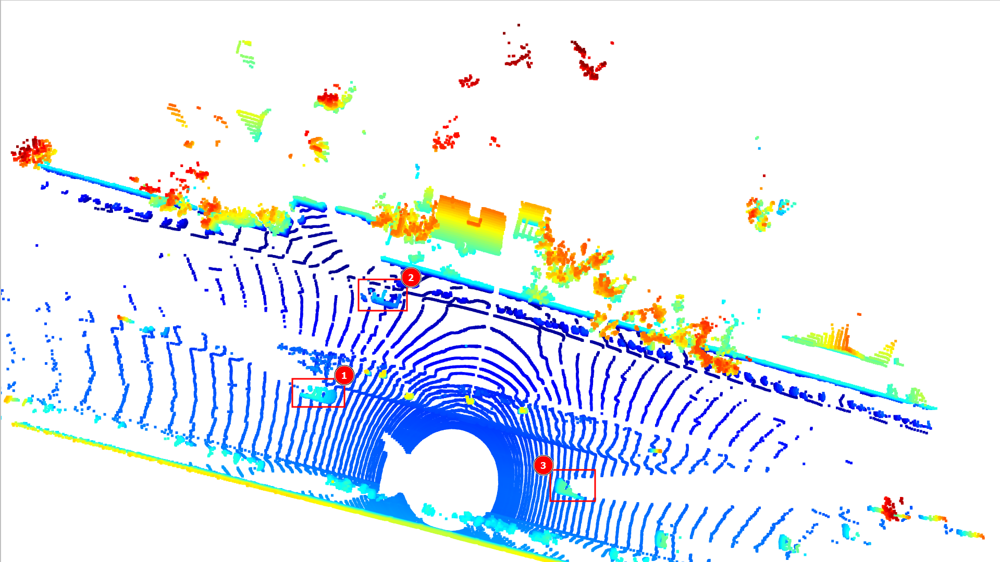
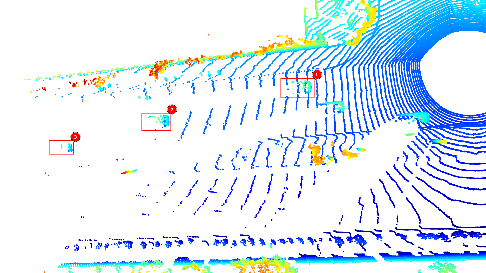
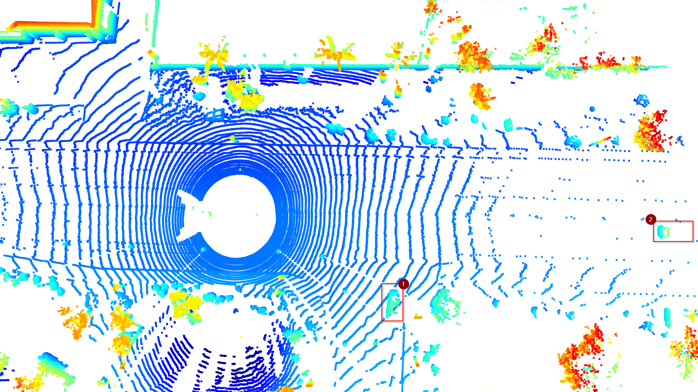
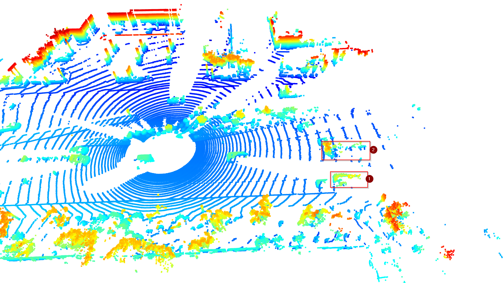
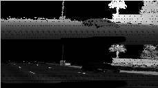
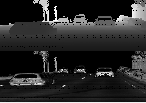
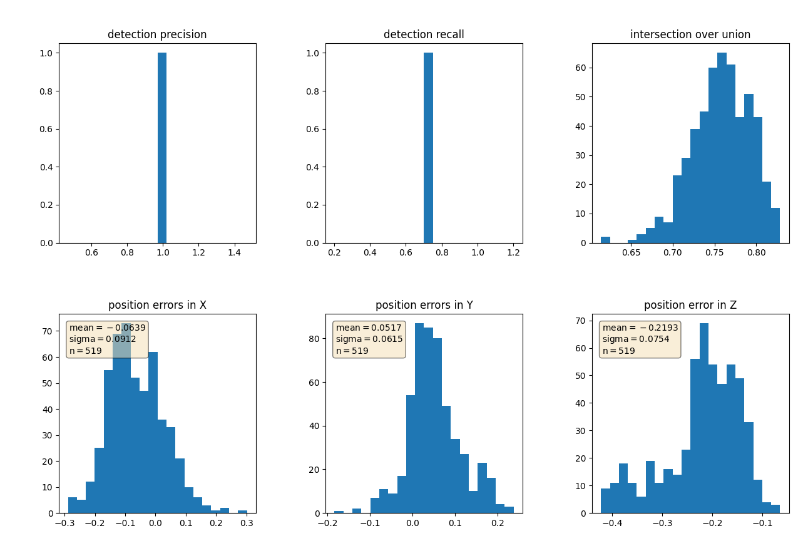

# Point Clouds
The following image shows from segment `1005...`, frame 0.

1. Shows a vehicle where the front and the side is visible
2. Shows a vehicle where the side is visible, but the front not so muc. As it is further away, there is also less detail on this vehicle.
3. Shows a vehicle where the rear and and part of the side is visible.

The following image shows from segment `1005...`, frame ~92.

1. Shows a vehicle where the rear is very visible, and some other details can also be seen.
2. Shows a vehicle that is further away, and such less deatils are vissible.
3. Shows a vehicle that is even further away, and as such only the rear bumper and some other part of the car is visible.

The following image shows from segment `1007...`, frame ~100.

1. Shows a vehicle in a side road, where the side of the vehicle is clearly visible.
2. Shows a vehicle that is at the edge of the point cloud, and thus only only the rear of the vehicle is visible.

The following image shows from segment `1096...`, frame ~100.

1. Shows a van where it is partially obscured by the two vehicle behind it.
2. Shows a cement truck, with the complex geometry of the truck clearly visible.

# Features

From the above range images, a couple of things are clear:
- The road markings are clearly visible
- The rear bumpers of the cars, with the tail lights and reflectors are clearly visible.
- Windshields are not as reflective, which makes sense as light is supposed to go through them.

# Results
The following results are from segment `1005...`, for all of the frames in the segment.

While the precision is pretty good, the recall isn't nearly as good.