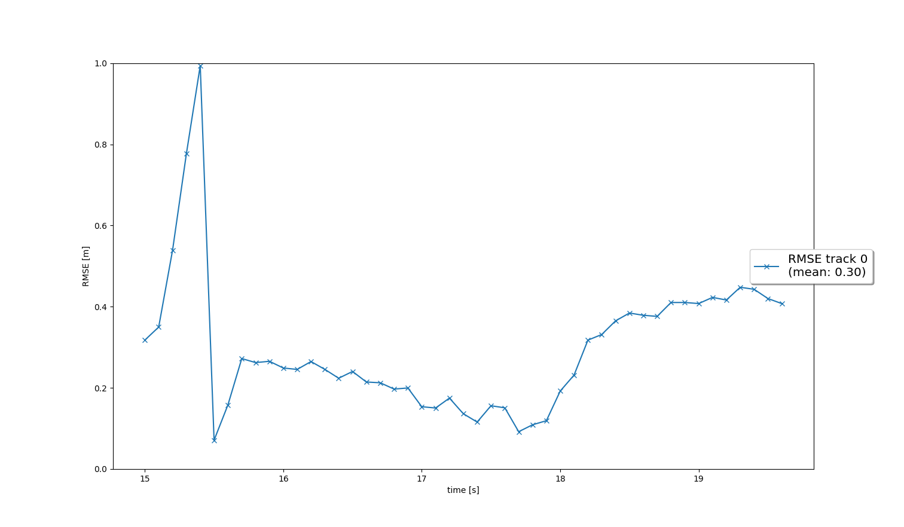
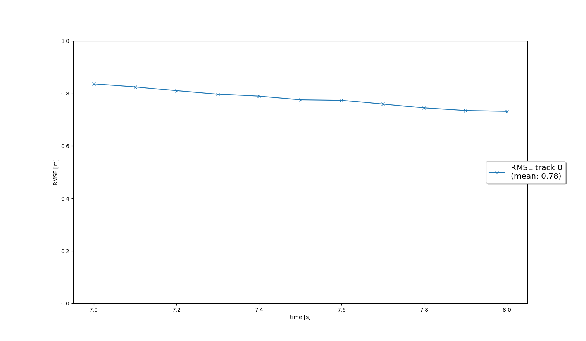
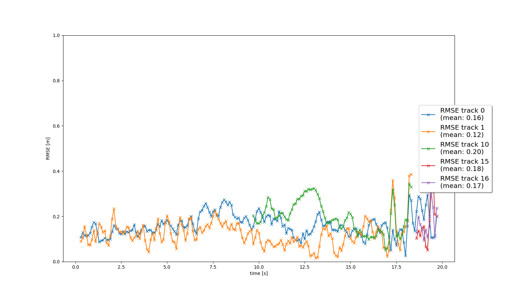
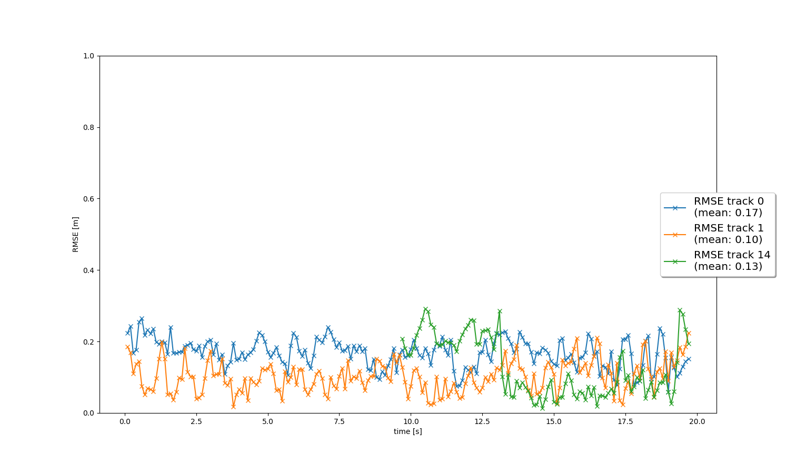

# Writeup: Track 3D-Objects Over Time

Please use this starter template to answer the following questions:

### 1. Write a short recap of the four tracking steps and what you implemented there (filter, track management, association, camera fusion). Which results did you achieve? Which part of the project was most difficult for you to complete, and why?
#### Step 1: Kalman Filtering
In this step, an Extended Kalman Filter (EKF) was implemented. It is interesting to note that I wouldn't this consider a "full" EKF. For the predict step, we assume a linear motion model, so this step is the same as the Standard Kalman Filter (SKF). For the update step, we actually have a mixture of linear and non-linear measurement models. So we only use an EKF for the update step when the measurement is coming from a camera. 

While none of the steps were particularly difficult, this would be the step where I made the biggest mistake. I made the assumption that for the process noise covariance matrix $Q$, the $q$ value for $v_z$ would be zero, as cars aren't likely to accelerate up or down very quickly. However, this caused a sneaky bug later where tracks were deleted when they should not have been. To fix this, I just over-estimated the $q$ value for $v_z$, by using the same value as for $v_x$ and $v_y$.
#### Step 2: Track Management
In this step, I initialised new tracks and deleted old tracks. Tracks are deleted when their covariance $P$ exceeds too high a value, or when their score decreases to low. I made the design decision to "clip" the track scores so that their score doesn't get too high and they last much longer than they should've. This is a step where you could play around with the parameters a lot in order to fine tune the tracking results.
#### Step 3: Data Association
In this step, an association matrix is used to do simple track-measurement association. A gating on the Mahalanobis distance is also used. While I used a similar approach as to the exercices of the course, there is also another way that managing the association matrix could be done. Instead of deleting rows and columns, we could instead set the values to a very high value (infinity). This might increase performance as we don't have to re-create objects.
#### Step 4: Camera Fusion
For this steps, the primary change was also using the camera measurements, instead of just lidar measurements. For this, the non-linear function $h(x)$ was implemented. Furthermore, a function to check if a measurement is within the sensors's field of view was also implemented.

### 2. Do you see any benefits in camera-lidar fusion compared to lidar-only tracking (in theory and in your concrete results)? 
In theory, camera-lidar sensor fusion helps in multiple ways. For example, Lidar sensors are capable of directly measuring distance while non-stereo cameras are not. Cameras are more susceptable to issues due to varied lighting conditions. Lidar sensors are active sensors and thus not as affected by this. Furthermore, just having more data-points allow for more accurate tracking, such as reducing the effects of ghost-tracks. In this project, we saw that the RMSE values were lower when using camera-lidar fusion compared to lidar-only tracking. However, the difference was not very large. For example, we can see that the mean RMSE values for the orange and green tracks dropped from Step 3 to Step 4. However, the mean RMSE for the blue track increased slightly.

### 3. Which challenges will a sensor fusion system face in real-life scenarios? Did you see any of these challenges in the project?
Two examples of challenges are:
- **Complex Urban Environments**: One very attractive use-case for self-driving cars is within in complex urban environments, where there is likely to be a lot of traffic. This means that there will be a lot of objects in the scene, and the sensor fusion system will need to be able to track all of them. In this project, the example sequences were rather simple, but still contained multiple objects that had to be tracked.
- **Object Occlusion**: Another challenge is that objects may be occluded because of other objects or environmental effects. This means that the sensor fusion system will need to be able to track objects even when they are partially occluded. In this project, there were some instances of partial occlusion due to other objects, but the example instances were mostly "clear skies".

### 4. Can you think of ways to improve your tracking results in the future?
One rather obvious way to improve the tracking results is to use more sensors. In this project, we only used the vehicle's top lidar and front-facing camera. However, the Waymo vehicle has more lidar and camera sensors that can be used as additional measurements. These sensors will also allow us to track objects that are not in the vehicle's forward-facing field of view. Radar sensors could also be used. These sensors might also be capable of measuring the objects' velocities, which would allow us to improve the tracking results. Finally, we could also use an improved tracking algorithm such as the Unscented Kalman Filter (UKF) and an improved data association algorithm.

# Results
## Video Results
[Video Results](https://youtu.be/gOad3YlZwmo)
## RMSE Plots:
### Step 1

### Step 2

### Step 3

*Note:* Here it can be seen that tracks 0 and 1 are "lost" and new tracks are found. This was due to a mistake that I made in initialising the process noise covariance matrix Q.
### Step 4

